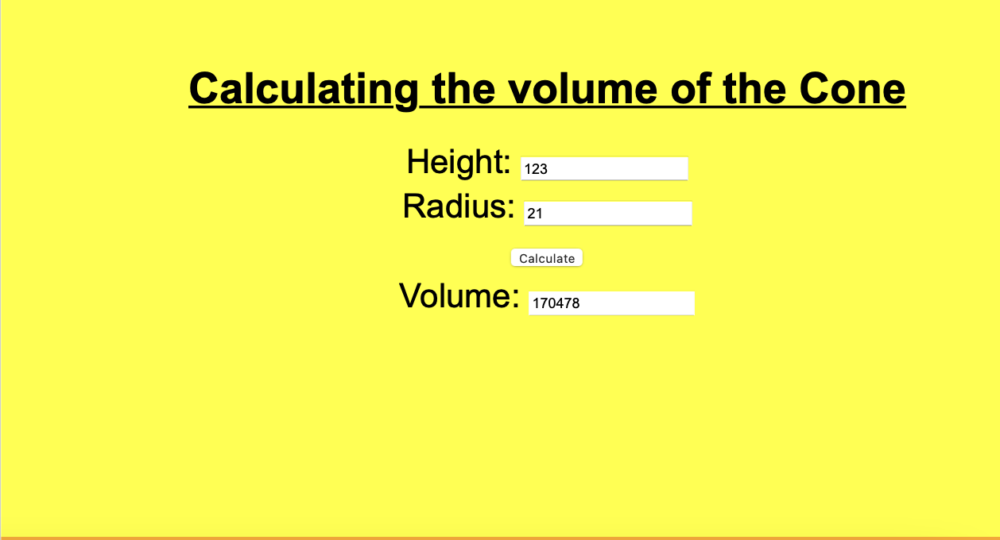
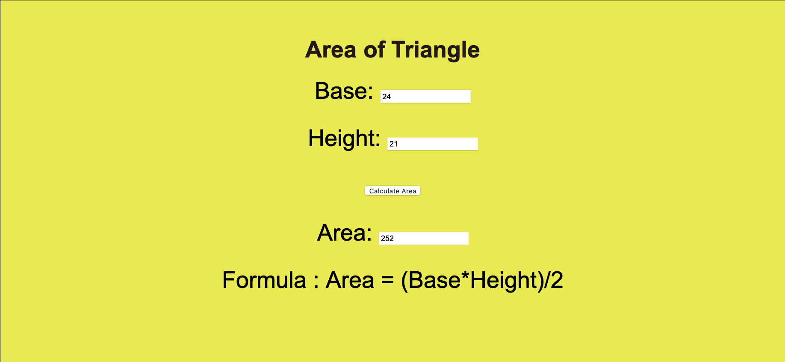

# Web Page for Mathematical Calculations

## AIM:

To design a static website with validation to perform mathematical calculations in client side.

## DESIGN STEPS:

### Step 1:

Requirement collection.

### Step 2:

Creating the layout using HTML and CSS.

### Step 3:

Write javascript to perform the calculations.

### Step 4:

Include regularexpression based input validation.

### Step 5:

Validate the layout in various browsers.

### Step 6:

Validate the HTML code.

### Step 6:

Publish the website in the given URL.

## PROGRAM :
<!DOCTYPE html>
<html lang="en">
<head>
    <meta charset="UTF-8">
    <meta http-equiv="X-UA-Compatible" content="IE=edge">
    <meta name="viewport" content="width=device-width, initial-scale=1.0">
    <title>Volume</title>
    

</head>

<body>
    

        

            <h1 class="text">Calculating the volume of the cylinder</h1>
            <form>
                
<label for="aEdit">Height:</label>
                    <input type="text" id="aEdit" value="0"/>
                

                
                

                    <label for="bEdit">Radius:</label>
                    <input type="text" id="bEdit" value="0"/>
                

                

                    <input type="button" value="Calculate" id="AddButton"/>
                

                
                

                    <label for="cEdit">Volume:</label>
                    <input type="text" id="cEdit" value="0" readonly />
                

            </form>

        

        

            <h1 class="text">Calculating the volume of the Cone</h1>
            <form>
                
<label for="hEdit">Height:</label>
                    <input type="text" id="hEdit" value="0"/>
                

                
                

                    <label for="rEdit">Radius:</label>
                    <input type="text" id="rEdit" value="0"/>
                

                

                    <input type="button" value="Calculate" id="AddButton1"/>
                

                
                

                    <label for="vEdit">Volume:</label>
                    <input type="text" id="vEdit" value="0" readonly />
                

            </form>

        

    

    
</body>
</html>
--include your code--

## OUTPUT:

-- include your output screenshots ---

## Result:

Thus a website is designed to perform mathematical calculations in the client side.
