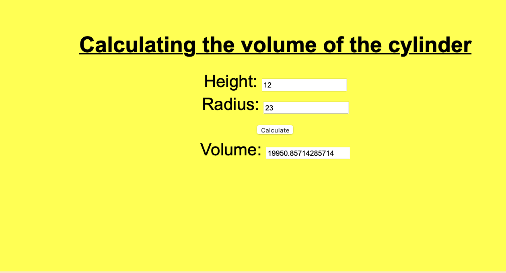

# Web Page for Mathematical Calculations

## AIM:

To design a static website with validation to perform mathematical calculations in client side.

## DESIGN STEPS:

### Step 1:

Requirement collection.

### Step 2:

Creating the layout using HTML and CSS.

### Step 3:

Write javascript to perform the calculations.

### Step 4:

Include regularexpression based input validation.

### Step 5:

Validate the layout in various browsers.

### Step 6:

Validate the HTML code.

### Step 6:

Publish the website in the given URL.

## PROGRAM :
<!DOCTYPE html>
<html lang="en">
<head>
    <meta charset="UTF-8">
    <meta http-equiv="X-UA-Compatible" content="IE=edge">
    <meta name="viewport" content="width=device-width, initial-scale=1.0">
    <title>Volume</title>
    
</head>
<body>
    

        

            <h1><B>Area of Triangle</B></h1>
            <form>
                

                    <lable for="aedit">Base:</lable>
                    <input type="text" id="aedit" value="0">
                
 
                

                    <lable for="bedit">Height:</lable>
                    <input type="text" id="bedit" value="0">
                
 
                

                    <input type="button" value="Calculate Area" id="calbutton">
                
 
                

                    <lable for="cedit">Area:</lable>
                    <input type="text" id="cedit" readonly="0">
                
 
                

                    Formula : Area = (Base*Height)/2
                

            </form>
        

        
        

            <h1><B>Volume of Cone</B></h1>
            <form>
                

                  <lable for="radiusedit">Radius:</lable>
                  <input type="text" id="radiusedit" value=" ">
                
 
                

                  <lable for="heightedit">Height:</lable>
                  <input type="text" id="heightedit" value=" ">
                
 
                

                  <input type="button" value="Calculate Volume" id="calbutton">
                
 
                

                  <lable for="volumeedit">Volume:</lable>
                  <input type="text" id="volumeedit" readonly="0">
                
 
                

                Formula : Volume=(π*Radius2*Height)/3
                
 
                
            </form>
    
            

        

             

      
<B>Developed by : jagan a </B>

</body>
</html>
--include your code--

## OUTPUT:

-- include your output screenshots ---

## Result:

Thus a website is designed to perform mathematical calculations in the client side.
